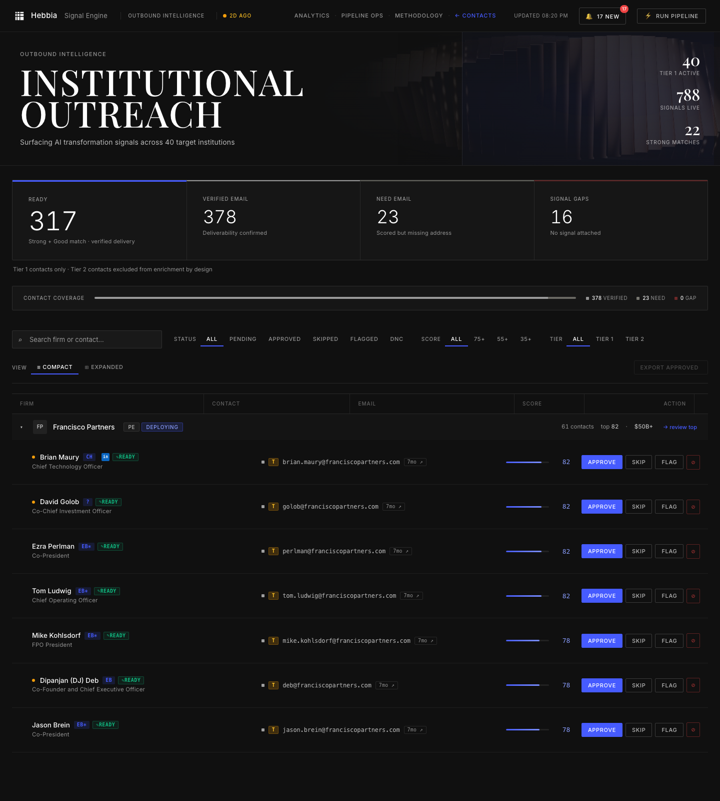
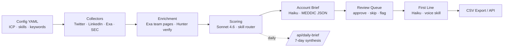

# MEDDIC Engine

I built 's outbound intelligence system as a GTM Engineer take-home. It monitors 16,639 SEC-registered investment advisers, filters to 7,115 ICP-qualified targets, and surfaces the right contacts at the right firms with the right message — scored, enriched, and ready for outreach.

**Live**: http://YOUR_VPS_IP:8080 · **Run locally**: `make run`



## What It Does

- Monitors Twitter/X, LinkedIn, financial press, and firm websites for AI transformation signals
- Scores contacts using a 4-dimension model (ICP Fit / AI Readiness / Reachability / Signal Freshness)
- Generates account intelligence briefs per contact using the platform's MEDDIC playbook as the intelligence layer
- Produces personalized first lines that reference specific signals, not generic AI praise
- Runs on a $5/month server, new client = new YAML config

## The Numbers

| Metric | Value |
|--------|-------|
| SEC-registered advisers indexed | 16,639 |
| ICP-qualified (PE / IB / credit / HF) | 7,115 |
| Tier-1 active firms | 40 |
| Tier-2 watchlist firms | 500 |
| Named contacts | 569 |
| Verified emails | 497 (87%) |
| Strong matches (score ≥75) | 27 |
| Ready for outreach (score ≥55 + verified) | 339 |
| Account briefs (MEDDIC-structured) | 484 |
| Live signals | 542 |
| Total AUM in pipeline | $15.2T |
| Cost per contact (fully loaded) | $0.026 |
| Build time | 6 days |

## Architecture



```
┌────────────────┐   ┌────────────────┐   ┌────────────────┐   ┌────────────────┐
│  CONFIG YAML   │──▶│   COLLECTORS   │──▶│   ENRICHMENT   │──▶│    SCORING     │
│  ICP, skills,  │   │  Twitter/X,    │   │  Exa team page │   │  Claude Sonnet │
│  keywords      │   │  LinkedIn,     │   │  + Hunter.io   │   │  + skill router│
│                │   │  Exa press,    │   │  verification  │   │  4-dim model   │
│                │   │  hiring        │   │                │   │                │
└────────────────┘   └────────────────┘   └────────────────┘   └────────────────┘
                                                                          │
                                                                          ▼
┌────────────────┐   ┌────────────────┐   ┌────────────────┐   ┌────────────────┐
│     REVIEW     │◀──│   FIRST LINE   │◀──│  ACCOUNT BRIEF │◀──│     QUEUE      │
│  Approve/skip/ │   │  Claude Haiku  │   │  Why Now /     │   │  Promote       │
│  flag + export │   │  + voice skill │   │  Objection /   │   │  qualified to  │
│                │   │                │   │  Angle / Proof │   │  review        │
└────────────────┘   └────────────────┘   └────────────────┘   └────────────────┘
```

**Layer notes**

1. **Config YAML** — ICP definitions, scoring weights, skill sections, collector queries. New client = new config, no code changes.
2. **Collectors** — Four independent signal sources, each normalized into a `signals` row. Fire-and-forget — failures are logged, never block the pipeline.
3. **Enrichment** — Exa neural search over firm team pages + Claude Haiku extraction for name/title, then Hunter.io for email verification. Contacts unfound in Hunter keep the lower-confidence guessed email.
4. **Contact Researcher** — Per-contact Exa research pass producing a sourced one-sentence research line (recent quote, hire, deal, panel) attached to each contact for downstream prompts.
5. **Scoring** — `claude-sonnet-4-6` call per (firm, contact, signals) triple. Skill router selects only the prompt sections relevant to that account, keeping context tight and consistent across hundreds of runs.
6. **MEDDIC Role Classifier** — Classifies each contact as Economic Buyer / Champion / Coach / Influencer / User with a confidence score and written reasoning. Drives per-firm coverage flags (`needs_eb`, `needs_ch`) so reps see which firms are missing a buyer or champion thread.
7. **Signal Attribution** — Two-gate matcher attaching signals to contacts via handle match OR name-similarity ≥0.80, so brief inputs cite only signals that actually belong to the person.
8. **Account Brief** — `claude-haiku-4-5-20251001` pass per scored contact. Produces a MEDDIC-structured JSON brief — Why Now, Likely Objection, Your Angle, Proof Point — so the rep reads intelligence, not a score.
9. **First Line** — Haiku pass, on demand, using the voice skill and specific signal context. No generic "I wanted to reach out…"
10. **Daily Brief** — Agentic `/api/daily-brief` endpoint summarizes the day's highest-signal firms and contacts, with a 30-min server-side cache.
11. **Review Queue** — Dark-theme dashboard with j/k navigation, approve/skip/flag, CSV export. Firm diversity sort floats the top 3 per firm so one account can't dominate the queue. Approvals write an audit row; skips capture the reason.

## Signal Sources

- **Twitter/X** — 8 seed finance accounts + keyword searches across the four signal categories (pain, evaluation, transformation, competitor frustration). Uses TwitterAPI.io.
- **LinkedIn** — Company posts + keyword search via Apify's LinkedIn Company Page scraper.
- **Financial press** — Exa neural search per firm + five industry-wide buying-signal queries (PE deploying AI, IB workflow automation, AlphaSense alternatives, etc.). Recency-filtered to the last 9 months.
- **Firm websites** — Direct team-page scraping + Exa-driven page discovery. Claude Haiku extracts named seniors with titles.
- **SEC Form ADV** — 16,639-firm universe from the SEC EDGAR bulk export. Populates the `sec_universe` table; AUM is joined back to active firms for the dashboard's AUM Coverage card.

## Scoring Model

```
Score = 0.30 × ICP Fit  +  0.25 × AI Readiness  +  0.25 × Reachability  +  0.20 × Signal Freshness
```

| Dimension | Weight | Measures |
|---|:---:|---|
| **ICP Fit** | 30% | Firm type, AUM tier, workflow fit. Tier-1 megafunds (Blackstone, Apollo, KKR) score highest. |
| **AI Readiness** | 25% | Buying stage, AI hiring, published AI strategy, firm-wide deployment signals. |
| **Reachability** | 25% | Verified email, named decision-maker with title match, LinkedIn presence. |
| **Signal Freshness** | 20% | Days since most recent signal. Last 30 days score strongly; older decays. |

**Thresholds**: 75+ Strong Match (approve) · 55–74 Good Match (review) · 35–54 Moderate (enrich) · <35 Weak (deprioritize).

### Skill Router

Before each scoring call a deterministic router picks the prompt sections that apply to *this* account and nothing else. A PE firm loads `icp_pe`; a Rogo customer loads `displacement_rogo`; a firm flagged `evaluating` loads `language_evaluating`. Claude only sees the sections relevant to each account — ICP type, competitor context, buying stage, signal types. This is 's sales playbook encoded as a prompt routing system.

## Docs

- [`docs/SUBMISSION.pdf`](docs/SUBMISSION.pdf) — final take-home submission
- [`docs/_signal_engine.pptx`](docs/_signal_engine.pptx) — presentation deck

## Stack

Python 3.9, Flask, SQLite (WAL, busy_timeout=5000), Claude API (`claude-sonnet-4-6` for scoring, `claude-haiku-4-5-20251001` for briefs + MEDDIC + first lines), Hunter.io, Exa AI (`exa-py`), TwitterAPI.io, Apify, SEC EDGAR bulk data.

Dashboard is static HTML + custom CSS (Google Fonts CDN only) + vanilla JS — no framework, no build step, loads one JSON file per page.

## Running It

```bash
cp .env.example .env
# Add: ANTHROPIC_API_KEY, HUNTER_API_KEY, TWITTER_API_KEY,
#      APIFY_API_TOKEN, EXA_API_KEY, API_KEY (for the review UI)

./start.sh            # Flask API + static server
python3 main.py --full   # collect → enrich → score → queue
python3 scripts/update_dashboard.py     # refresh the review dashboard
python3 scripts/update_analytics.py     # refresh pipeline analytics
python3 scripts/match_sec_aum.py        # attach AUM to active firms

# Then open http://localhost:8765/index.html
```

**Run modes**: `--collect` · `--score` · `--enrich` · `--queue` · `--full` · `--sample` (no live API calls).
