# MEDDIC Engine

Outbound intelligence for enterprise sales — monitors 16,639 SEC-registered investment advisers, filters to 7,115 ICP-qualified targets, and surfaces the right contact at the right firm with the right message. Every account brief is MEDDIC-structured: Economic Buyer, Champion, Pain, Decision Process. Built in 6 days as a portfolio exploration of applying MEDDIC qualification at signal scale.

**Run locally**: `make run`


## What It Does

- Monitors Twitter/X, LinkedIn, financial press, and firm websites for AI transformation signals
- Scores contacts using a 4-dimension model (ICP Fit / AI Readiness / Reachability / Signal Freshness)
- Classifies each contact's MEDDIC role (Economic Buyer / Champion / Coach / Influencer / User) and flags firms missing a buyer or champion thread
- Generates MEDDIC-structured account briefs — Why Now, Likely Objection, Your Angle, Proof Point — so reps read intelligence, not just a score
- Produces personalized first lines that reference specific signals, not generic AI praise
- Runs on a $5/month server. New vertical = new YAML config, no code changes

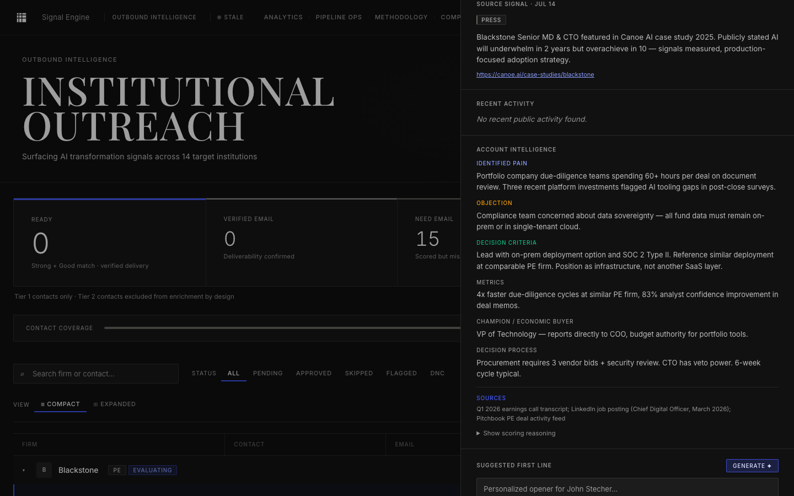

## Why MEDDIC

Enterprise sales teams already qualify with MEDDIC. The framework asks the right questions — but answering them at scale across hundreds of accounts is the hard part. Most rep prep is gut feel: which firm is real, who's the champion, what's the pain. MEDDIC Engine answers those questions empirically — pulling signals from public sources, classifying roles with Claude, and producing structured briefs a rep can act on without an hour of manual research per account.

The framework is the abstraction. Finance is the example use case. The same architecture works for any complex enterprise sale where MEDDIC qualification matters and signal volume is the bottleneck.

## The Numbers

| Metric | Value |
|--------|-------|
| SEC-registered advisers indexed | 16,639 |
| ICP-qualified (PE / IB / credit / HF) | 7,115 |
| Tier-1 active firms | 40 |
| Tier-2 watchlist firms | 500 |
| Named contacts | 569 |
| Verified emails | 497 (87%) |
| Strong matches (score ≥75) | 27 |
| Ready for outreach (score ≥55 + verified) | 339 |
| Account briefs (MEDDIC-structured) | 484 |
| Live signals | 542 |
| Total AUM in pipeline | $15.2T |
| Cost per contact (fully loaded) | $0.026 |
| Build time | 6 days |

## Architecture

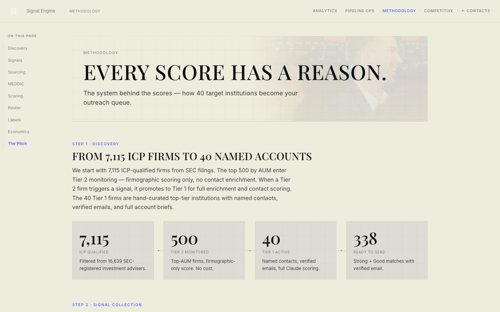

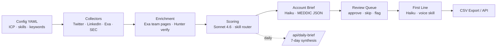

```
┌────────────────┐   ┌────────────────┐   ┌────────────────┐   ┌────────────────┐
│  CONFIG YAML   │──▶│   COLLECTORS   │──▶│   ENRICHMENT   │──▶│    SCORING     │
│  ICP, skills,  │   │  Twitter/X,    │   │  Exa team page │   │  Claude Sonnet │
│  keywords      │   │  LinkedIn,     │   │  + Hunter.io   │   │  + skill router│
│                │   │  Exa press,    │   │  verification  │   │  4-dim model   │
│                │   │  hiring        │   │                │   │                │
└────────────────┘   └────────────────┘   └────────────────┘   └────────────────┘
                                                                          │
                                                                          ▼
┌────────────────┐   ┌────────────────┐   ┌────────────────┐   ┌────────────────┐
│     REVIEW     │◀──│   FIRST LINE   │◀──│  ACCOUNT BRIEF │◀──│     QUEUE      │
│  Approve/skip/ │   │  Claude Haiku  │   │  Why Now /     │   │  Promote       │
│  flag + export │   │  + voice skill │   │  Objection /   │   │  qualified to  │
│                │   │                │   │  Angle / Proof │   │  review        │
└────────────────┘   └────────────────┘   └────────────────┘   └────────────────┘
```

**Layer notes**

1. **Config YAML** — ICP definitions, scoring weights, skill sections, collector queries. New client = new config, no code changes.
2. **Collectors** — Four independent signal sources, each normalized into a `signals` row. Fire-and-forget — failures are logged, never block the pipeline.
3. **Enrichment** — Exa neural search over firm team pages + Claude Haiku extraction for name/title, then Hunter.io for email verification. Contacts unfound in Hunter keep the lower-confidence guessed email.
4. **Contact Researcher** — Per-contact Exa research pass producing a sourced one-sentence research line (recent quote, hire, deal, panel) attached to each contact for downstream prompts.
5. **Scoring** — `claude-sonnet-4-6` call per (firm, contact, signals) triple. Skill router selects only the prompt sections relevant to that account, keeping context tight and consistent across hundreds of runs.
6. **MEDDIC Role Classifier** — Classifies each contact as Economic Buyer / Champion / Coach / Influencer / User with a confidence score and written reasoning. Drives per-firm coverage flags (`needs_eb`, `needs_ch`) so reps see which firms are missing a buyer or champion thread.
7. **Signal Attribution** — Two-gate matcher attaching signals to contacts via handle match OR name-similarity ≥0.80, so brief inputs cite only signals that actually belong to the person.
8. **Account Brief** — `claude-haiku-4-5-20251001` pass per scored contact. Produces a MEDDIC-structured JSON brief — Why Now, Likely Objection, Your Angle, Proof Point — so the rep reads intelligence, not a score.
9. **First Line** — Haiku pass, on demand, using the voice skill and specific signal context. No generic "I wanted to reach out…"
10. **Daily Brief** — Agentic `/api/daily-brief` endpoint summarizes the day's highest-signal firms and contacts, with a 30-min server-side cache.
11. **Review Queue** — Dark-theme dashboard with j/k navigation, approve/skip/flag, CSV export. Firm diversity sort floats the top 3 per firm so one account can't dominate the queue. Approvals write an audit row; skips capture the reason.

## Signal Sources

- **Twitter/X** — 8 seed finance accounts + keyword searches across the four signal categories (pain, evaluation, transformation, competitor frustration). Uses TwitterAPI.io.
- **LinkedIn** — Company posts + keyword search via Apify's LinkedIn Company Page scraper.
- **Financial press** — Exa neural search per firm + five industry-wide buying-signal queries (PE deploying AI, IB workflow automation, AlphaSense alternatives, etc.). Recency-filtered to the last 9 months.
- **Firm websites** — Direct team-page scraping + Exa-driven page discovery. Claude Haiku extracts named seniors with titles.
- **SEC Form ADV** — 16,639-firm universe from the SEC EDGAR bulk export. Populates the `sec_universe` table; AUM is joined back to active firms for the dashboard's AUM Coverage card.

## Scoring Model

```
Score = 0.30 × ICP Fit  +  0.25 × AI Readiness  +  0.25 × Reachability  +  0.20 × Signal Freshness
```

| Dimension | Weight | Measures |
|---|:---:|---|
| **ICP Fit** | 30% | Firm type, AUM tier, workflow fit. Tier-1 megafunds (Blackstone, Apollo, KKR) score highest. |
| **AI Readiness** | 25% | Buying stage, AI hiring, published AI strategy, firm-wide deployment signals. |
| **Reachability** | 25% | Verified email, named decision-maker with title match, LinkedIn presence. |
| **Signal Freshness** | 20% | Days since most recent signal. Last 30 days score strongly; older decays. |

**Thresholds**: 75+ Strong Match (approve) · 55–74 Good Match (review) · 35–54 Moderate (enrich) · <35 Weak (deprioritize).

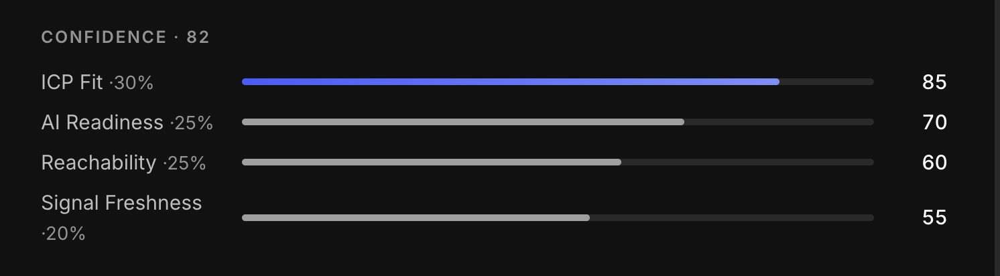

No black-box numbers: every score expands inline on the contact card into its four weighted sub-scores, so a rep sees *why* it's an 82 — strong ICP fit, decent AI readiness, a verified contact, a slightly stale signal — not just that it is.

### Skill Router

Before each scoring call a deterministic router picks the prompt sections that apply to *this* account and nothing else. A PE firm loads `icp_pe`; a Rogo customer loads `displacement_rogo`; a firm flagged `evaluating` loads `language_evaluating`. Claude only sees the sections relevant to each account — ICP type, competitor context, buying stage, signal types. This is a sales playbook encoded as a prompt routing system.

## Inside the dashboard

The dashboard isn't a demo skin over a CSV — it's the operating surface for the pipeline. Static HTML, custom CSS, vanilla JS; one JSON file per page; loads instantly on the $5/month box. Every number on it traces back to a row in the SQLite database.

### Pipeline ops — what the engine did, in plain sight

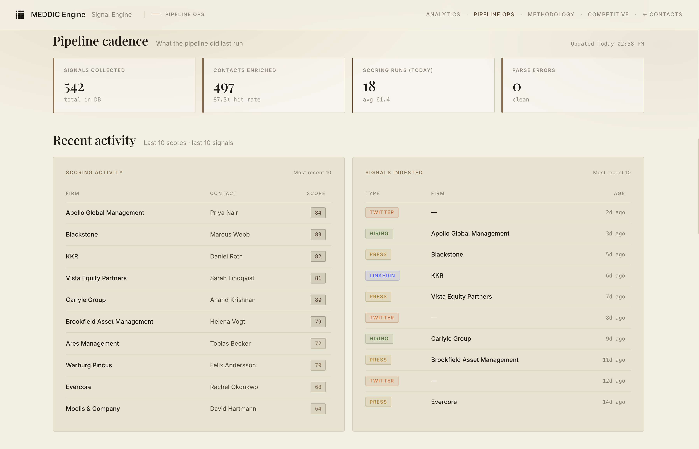

Every run is auditable: signals collected, contacts enriched (with the Hunter hit rate), scoring runs today, parse errors — plus a live feed of the last ten scores and the last ten signals ingested. Nothing is a black box.

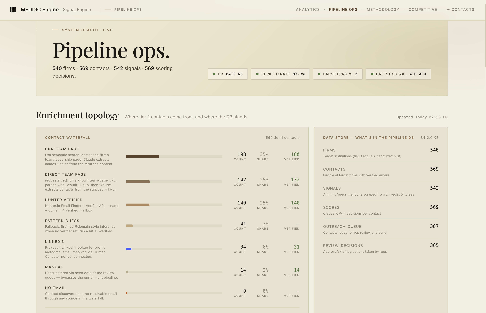

Where every tier-1 contact's email actually came from — Exa team-page extraction, direct scrape, Hunter verification, pattern-guess fallback, LinkedIn, manual — and a live readout of what's sitting in the database right now. The whole pipeline is one file you can `sqlite3` into.

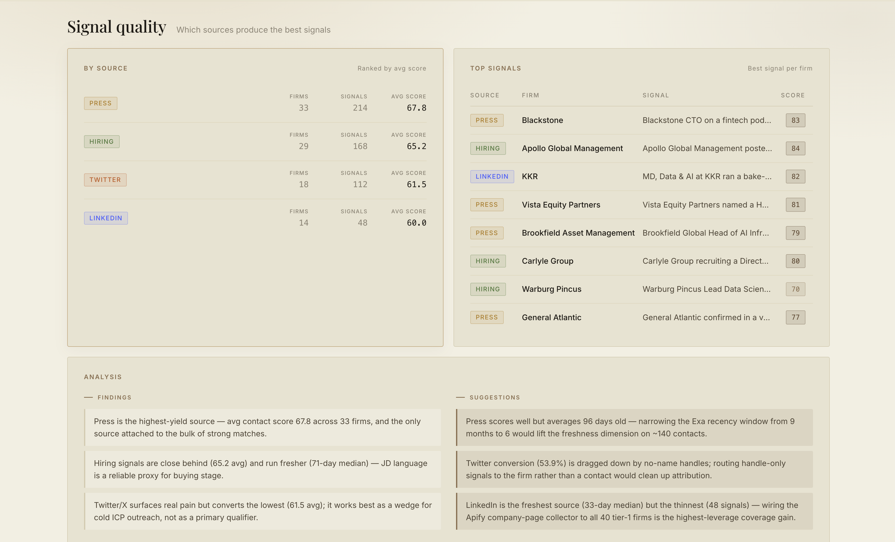

Which sources are pulling their weight. Press signals score highest and attach to the bulk of strong matches; hiring signals run fresher; Twitter surfaces real pain but converts lower — so the page recommends using it as a cold-outreach wedge, not a primary qualifier. The engine has opinions about its own inputs, with the next optimization spelled out.

### Analytics — the whole funnel, end to end

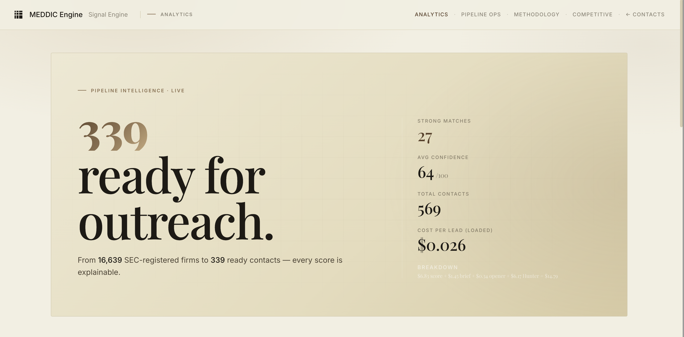

16,639 SEC-registered investment advisers in; 339 outreach-ready contacts out — each one with an explainable score, at a fully loaded cost of $0.026 per contact.

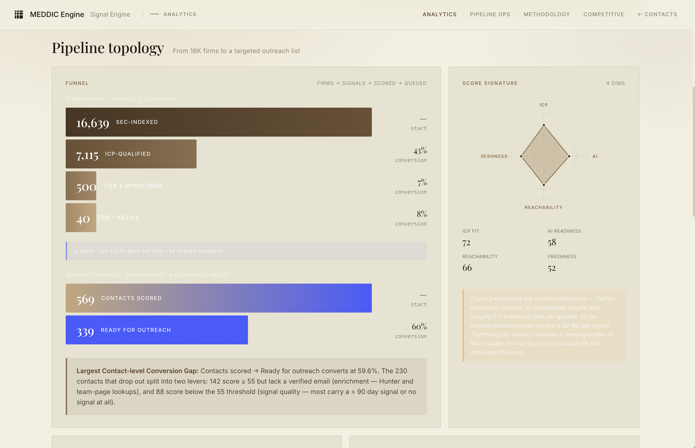

The funnel as a shape: SEC universe → ICP filter → tier-2 watchlist → tier-1 active → contacts scored → ready for outreach. The four-dimension score signature on the right shows which lever is weakest (signal freshness, every time), and the conversion-gap callout names the two things to fix to widen the bottom of the funnel.

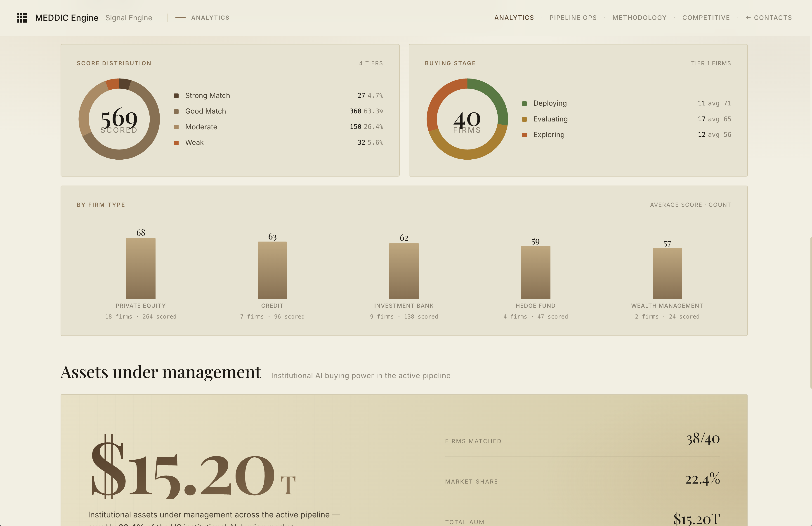

Score distribution, buying-stage mix, average score by firm type, and the assets under management represented in the active pipeline — $15.2T, roughly a fifth of the US institutional AI-buying market.

### Methodology — every step, documented in the product

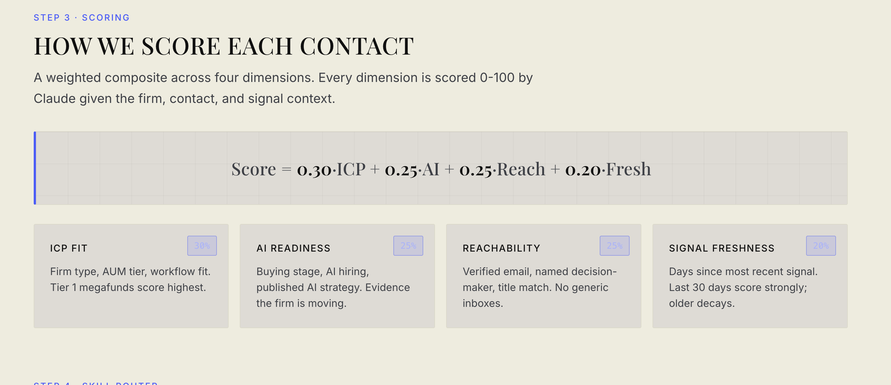

The methodology page walks the whole pipeline — sources, attribution, the MEDDIC mapping, the scoring model — right inside the app, not in a separate doc that drifts. Shown here: the scoring step, with the four weights and what each dimension actually measures.

## Stack

Python 3.9, Flask, SQLite (WAL, busy_timeout=5000), Claude API (`claude-sonnet-4-6` for scoring, `claude-haiku-4-5-20251001` for briefs + MEDDIC + first lines), Hunter.io, Exa AI (`exa-py`), TwitterAPI.io, Apify, SEC EDGAR bulk data.

Dashboard is static HTML + custom CSS (Google Fonts CDN only) + vanilla JS — no framework, no build step, loads one JSON file per page.

## Running It

```bash
cp .env.example .env
# Add: ANTHROPIC_API_KEY, HUNTER_API_KEY, TWITTER_API_KEY,
#      APIFY_API_TOKEN, EXA_API_KEY, API_KEY (for the review UI)

./start.sh            # Flask API + static server
python3 main.py --full   # collect → enrich → score → queue
python3 scripts/update_dashboard.py     # refresh the review dashboard
python3 scripts/update_analytics.py     # refresh pipeline analytics
python3 scripts/match_sec_aum.py        # attach AUM to active firms

# Then open http://localhost:8765/index.html
```

**Run modes**: `--collect` · `--score` · `--enrich` · `--queue` · `--full` · `--sample` (no live API calls).
